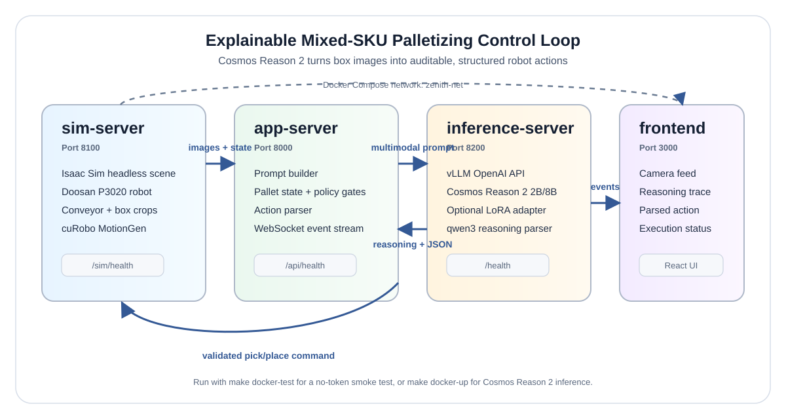
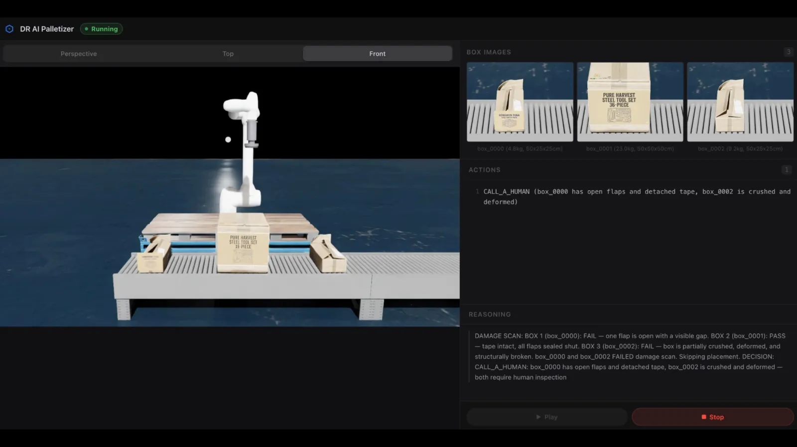
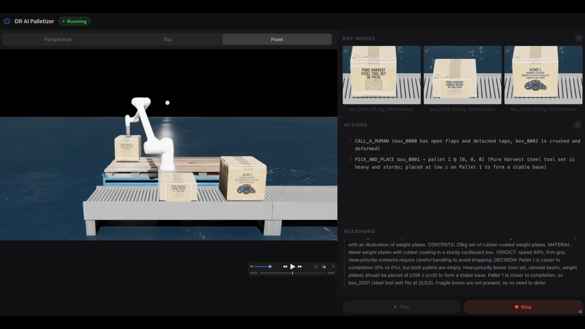

# See How It Thinks: Mixed Palletizing with Explainable Visual Reasoning

> **Authors:** Kyungchan Son, Minsoo Song, Yujeong Jeong, and Yuri Rocha -- Doosan Robotics
> **Organization:** [Doosan Robotics](https://www.doosanrobotics.com/) x NVIDIA Robotics

| **Model** | **Workload** | **Use Case** |
|-----------|--------------|--------------|
| [Cosmos Reason 2 (2B / 8B)](https://huggingface.co/nvidia/Cosmos-Reason2-8B), [Isaac Sim](https://developer.nvidia.com/isaac-sim), [cuRobo](https://curobo.org/), [vLLM](https://docs.vllm.ai/) | End-to-End | Explainable mixed-SKU palletizing: visual inspection, handling policy, and simulated robot execution |

> **Source:** [doosan-robotics/explainable-palletizer](https://github.com/doosan-robotics/explainable-palletizer)
> **Demo video:** [YouTube](https://www.youtube.com/watch?v=4Yq0ESmKPPw)
> **Doosan write-up:** [What Embodied Reasoning AI Could Mean for Real-World Palletizing](https://www.doosanrobotics.com/en/about/promotion/blog/what-embodied-reasoning-ai-could-mean-for-real-world-palletizing)

> **Prerequisites:** This workflow requires a Hugging Face token for gated Cosmos Reason 2 weights, an NVIDIA driver >= 585, CUDA >= 12.8, Docker with Compose V2, and the NVIDIA Container Toolkit. Use `make docker-test` first if you want a no-token smoke test.

## Overview

In warehouse palletizing, robots often follow fixed rules: pick the next case, place it in the next slot, repeat. That works when packaging is consistent and every box is intact. It gets brittle when the line contains mixed products, damaged cartons, fragile goods, or ambiguous handling labels.

This recipe runs Doosan Robotics' "explainable palletizer" proof-of-concept. Cosmos Reason 2 receives camera crops of the boxes on the conveyor, reasons about visible labels and packaging condition, and emits a structured action for a simulated Doosan P3020 palletizing arm in Isaac Sim. The loop is auditable: the UI shows the camera feed, the model's reasoning trace, the parsed action, and the simulated execution.

<p align="center">
  
</p>

The project won first place at the NVIDIA Cosmos Cookoff.

## What You Will Run

The upstream project launches a Docker Compose stack with four services on the `zenith-net` network:

| Service | Port | What it does |
|---------|------|--------------|
| `sim-server` | 8100 | Runs Isaac Sim headlessly, spawns the Doosan P3020, creates box images, and executes cuRobo-planned pick/place trajectories |
| `inference-server` | 8200 | Runs vLLM's OpenAI-compatible server for Cosmos Reason 2, with optional LoRA loading |
| `app-server` | 8000 | FastAPI orchestrator that builds prompts, parses responses, maintains pallet state, and streams events |
| `frontend` | 3000 | React UI for camera, reasoning, action parameters, and execution state |

The control loop:

1. `sim-server` keeps a conveyor buffer populated with 1-3 visible boxes.
2. `app-server` requests box images, weights, dimensions, pallet state, and valid placement cells.
3. `app-server` sends the images plus a structured prompt to `inference-server`.
4. Cosmos Reason 2 returns a reasoning trace and JSON action.
5. `app-server` validates the action against pallet constraints, converts grid cells to world coordinates, and calls `sim-server`.
6. `sim-server` uses cuRobo inside the Isaac Sim process to plan and execute the robot motion.

## Why Explainable Reasoning?

Mixed-SKU palletizing is a long-tail manipulation problem. A rule-based system can work well for one known case size and one known load pattern, then fail as soon as a supplier changes packaging or a damaged carton reaches the robot.

The Doosan project focuses on the expensive exceptions:

- **Packaging damage:** open flaps, torn tape, crushed cardboard, contamination, or contents at risk of falling out.
- **Fragility and handling:** glass, electronics, liquids, cans, and paper goods need different speed and grip settings.
- **Load quality:** heavy or sturdy boxes should form stable bases while fragile boxes should avoid crushing loads.
- **Auditability:** operators need to see why the system placed, slowed down, or rejected a box.

Cosmos Reason 2 is used here as a visual reasoning policy: it reads visible text and handling symbols, inspects packaging condition, and chooses between `PICK_AND_PLACE`, `CALL_A_HUMAN`, and `WAIT`.

## Before You Start

Pick the smallest run mode that answers your question:

| Mode | Command | Token required | Suggested hardware | Purpose |
|------|---------|----------------|--------------------|---------|
| Smoke test | `make docker-test` | No | NVIDIA GPU with Isaac Sim support | Verify Docker, Isaac Sim, app-server, frontend, and WebSocket plumbing with a tiny stand-in model |
| 2B base model | `INFERENCE_MODEL=nvidia/Cosmos-Reason2-2B` in `docker/.env`, then `make docker-up` | Yes | 1x RTX 4090-class 24 GB GPU | Functional run on workstation-class hardware |
| 8B base model | Default `INFERENCE_MODEL=nvidia/Cosmos-Reason2-8B` | Yes | H200, RTX PRO 6000, Jetson Thor, or equivalent | Best-quality run for the full demo |
| LoRA adapter | Set `LORA_ADAPTER_PATH` and `LORA_MODEL` after `make adapters` | Yes | Same as matching base model | Optional; currently not recommended until upstream republishes adapters for the new prompt format |

Run these host checks before a full launch:

```bash
nvidia-smi
docker compose version
docker run --rm --gpus all nvidia/cuda:12.8.0-base-ubuntu24.04 nvidia-smi
df -h ~/.cache/huggingface
```

If the host does not meet the GPU or driver requirements, use a GPU workstation or a cloud instance with matching NVIDIA driver, CUDA, Docker, and NVIDIA Container Toolkit support.

## Prerequisites

### System Requirements

| Requirement | Version |
| --- | --- |
| NVIDIA driver | 585+ |
| CUDA | 12.8+ |
| Docker | Docker Engine with Compose V2 |
| NVIDIA Container Toolkit | Installed and configured |
| Disk | At least 30 GB free for image layers and Hugging Face cache |

### Tested Hardware

| Hardware | Architecture | Notes |
| --- | --- | --- |
| NVIDIA RTX 4090 | Ada Lovelace | Use the 2B model first |
| NVIDIA H200 | Hopper | Good target for the 8B model |
| NVIDIA RTX PRO 6000 / Jetson Thor | Blackwell | `launch.sh` selects CUDA 13 / Jetson vLLM images when needed |

### Hugging Face Access

Cosmos Reason 2 is gated. Before a full run:

1. Create a Hugging Face token at [huggingface.co/settings/tokens](https://huggingface.co/settings/tokens).
2. Accept the model license for [nvidia/Cosmos-Reason2-8B](https://huggingface.co/nvidia/Cosmos-Reason2-8B) or [nvidia/Cosmos-Reason2-2B](https://huggingface.co/nvidia/Cosmos-Reason2-2B).

### Install `uv` and Hugging Face CLI

```bash
curl -LsSf https://astral.sh/uv/install.sh | sh
uv run --with "huggingface-hub[cli]" hf --help
```

## Quickstart

### 1. Clone the upstream repo

```bash
git clone https://github.com/doosan-robotics/explainable-palletizer.git
cd explainable-palletizer
```

### 2. Configure Docker environment

```bash
cp docker/.env.example docker/.env
```

Edit `docker/.env`:

| Variable | Description | Default |
| --- | --- | --- |
| `HF_TOKEN` | Hugging Face token for gated Cosmos models | empty |
| `INFERENCE_MODEL` | `nvidia/Cosmos-Reason2-2B` or `nvidia/Cosmos-Reason2-8B` | `nvidia/Cosmos-Reason2-8B` |
| `LORA_ADAPTER_PATH` | LoRA adapter path inside the container, e.g. `/adapters/2B` or `/adapters/8B` | empty |
| `LORA_MODEL` | LoRA model name exposed by vLLM and used by the app, e.g. `palletize` | empty |
| `VLLM_MAX_MODEL_LEN` | Context length. Keep this >= 8096 because the app sends ~2200 input tokens and asks for up to 4096 output tokens | `8096` |
| `VLLM_GPU_MEMORY_UTILIZATION` | Fraction of GPU memory reserved for vLLM | `0.5` |
| `VLLM_REASONING_PARSER` | vLLM reasoning parser for Cosmos Reason 2 | `qwen3` |
| `HF_CACHE_DIR` | Host Hugging Face cache directory mounted into the inference container | Docker named volume |
| `SIM_GPU_DEVICE` / `INFERENCE_GPU_DEVICE` | Host GPU IDs for Isaac Sim and inference | `0` |
| `CUROBO_GPU_DEVICE` | Optional second GPU for cuRobo when Isaac Sim and cuRobo need separate CUDA contexts | empty |
| `SIM_PORT` / `INFERENCE_PORT` / `APP_PORT` / `FRONTEND_PORT` | Host ports for the four services | `8100` / `8200` / `8000` / `3000` |
| `STEP_LOG_DIR` | Container path for per-step artifact logging (prompt, raw response, parsed action, box images). Leave empty to disable. Example: `/logs/steps` | empty |
| `INTERACTION_LOG` | Container path for the append-only JSONL interaction log (one line per VLM call). Leave empty to disable. Example: `/logs/interactions.jsonl` | empty |
| `SIM_LOAD_ROBOT` | Spawn the Doosan P3020 inside Isaac Sim. Set `false` to drive only the camera/conveyor for VLM debugging | `true` |
| `SIM_SPAWN_BOXES` | Auto-populate the conveyor buffer. Set `false` when you want to feed boxes manually via the sim API | `true` |

### 3. Pre-download model weights

This is optional, but it makes rebuilds much faster:

```bash
uv run --with "huggingface-hub[cli]" hf download nvidia/Cosmos-Reason2-2B
# or
uv run --with "huggingface-hub[cli]" hf download nvidia/Cosmos-Reason2-8B
```

Then set `HF_CACHE_DIR=~/.cache/huggingface` in `docker/.env`.

### 4. Download LoRA adapters (optional)

```bash
make adapters
```

This downloads:

- `yurirocha15/Cosmos-Reason2-2B-palletizer-lora` into `adapters/2B`
- `yurirocha15/Cosmos-Reason2-8B-palletizer-lora` into `adapters/8B`

> **Current upstream note:** the prompt and reasoning format were redesigned after these adapters were trained. Until updated adapters are published, leave `LORA_ADAPTER_PATH` and `LORA_MODEL` empty and run the base model.

### 5. Launch the stack

```bash
make docker-up
```

The first full build can take 30+ minutes because Isaac Sim is large, vLLM may compile CUDA extensions, and model weights may download. `launch.sh` waits for the service health checks and prints URLs when the stack is ready.

Follow logs in a second terminal:

```bash
make docker-logs
```

### 6. Open the UI

Navigate to [http://localhost:3000](http://localhost:3000). You should see:

- live Isaac Sim camera frames,
- current conveyor boxes,
- the model reasoning panel,
- parsed action parameters,
- robot execution status.

Stop the stack:

```bash
make docker-down
```

### No-token smoke test

```bash
make docker-test
```

This uses real Isaac Sim and a tiny stand-in model so you can validate the Docker stack without gated weights.

## Model Output Contract

The application accepts three action types from the model:

| Action | Required fields | Meaning |
|--------|-----------------|---------|
| `PICK_AND_PLACE` | `box`, `target_pallet`, `position`, `speed_pct`, `grip_strength`, `reason` | Pick one visible box and place it at a valid pallet position |
| `CALL_A_HUMAN` | `boxes`, `reason` | Remove damaged, contaminated, unsealed, or otherwise unsafe boxes for inspection |
| `WAIT` | `reason` | Wait only when too few boxes are visible and no safe placement or human call is appropriate |

`PICK_AND_PLACE` field constraints (enforced by the prompt and validated by `action_parser.py`):

| Field | Type | Allowed values |
|-------|------|----------------|
| `box` | string | one of the visible box IDs (e.g. `box_0001`) |
| `target_pallet` | int | `1` or `2` (1-indexed; `control_loop.py` converts to `pallet_idx`) |
| `position` | `[x, y, z]` | **must** be one of the pre-computed valid positions for `box` on `target_pallet` (the prompt lists them per box; the model cannot invent coordinates) |
| `speed_pct` | int | `40`, `80`, or `100` |
| `grip_strength` | string | `"standard"`, `"gentle"`, or `"firm"` (defaults to `"standard"` when omitted) |
| `reason` | string | brief rationale shown alongside the parsed action |

The parser supports `<answer>...</answer>` JSON blocks, fenced JSON, and raw JSON objects containing `"action"`. The UI displays the reasoning text separately from the parsed action so operators can review the decision path.

## Pipeline Components

### App server

The orchestrator lives in `app/src/dr_ai_palletizer/`:

| File | Role |
|------|------|
| `server.py` | FastAPI app, control endpoints, and WebSocket event streaming |
| `control_loop.py` | Async state machine for polling boxes, calling inference, parsing actions, and executing pick/place |
| `prompt_builder.py` | Converts box images and pallet state into OpenAI-compatible multimodal messages |
| `action_parser.py` | Extracts reasoning and JSON actions from model responses |
| `domain/models.py` | Prompt constants, scenario serialization, box/pallet constants |
| `domain/pallet.py` | Pallet occupancy, valid-position search, and placement updates |

### Inference server

`docker/inference/entrypoint.sh` launches `vllm serve` with:

- `--model $INFERENCE_MODEL`,
- `--max-model-len $VLLM_MAX_MODEL_LEN`,
- `--gpu-memory-utilization $VLLM_GPU_MEMORY_UTILIZATION`,
- `--reasoning-parser qwen3`,
- optional `--enable-lora` / `--lora-modules` when adapter variables are set.

### Sim server

The sim side lives in `sim/src/drp_sim/`:

| File | Role |
|------|------|
| `server.py` | Starts Isaac Sim on the main thread and uvicorn in a daemon thread |
| `api.py` | REST endpoints under `/sim/...` for camera, boxes, geometry, and robot commands |
| `motion_interface.py` | cuRobo `MotionGen` wrapper for joint-space and Cartesian trajectories |
| `pallet_solver.py` / `pallet_state.py` | Pallet placement utilities used by the simulated scene |
| `box_image_capture.py` | Captures per-box image crops for VLM inspection |

There is no separate `motion` container in the current Compose stack. cuRobo runs inside `sim-server`; `CUROBO_GPU_DEVICE` only changes which GPU cuRobo sees inside that container.

### Frontend

The React UI lives in `app/ui/` in the development tree and is packaged by `docker/frontend/Dockerfile` for the Compose run. It displays simulation video, box cards, reasoning, parsed actions, and control buttons.

## Monitoring

```bash
make docker-logs
cd docker
docker compose logs -f inference-server
docker compose logs -f sim-server
docker compose ps
cd ..
```

Health checks:

```bash
curl http://localhost:8200/health
curl http://localhost:8100/sim/health
curl http://localhost:8000/api/health
curl http://localhost:3000/api/status
```

Useful development targets:

```bash
make init             # first-time setup: uv sync, CUDA torch, adapters
make sync             # re-sync dependencies without overwriting CUDA torch
make install-curobo   # install cuRobo from source (run after make init)
make lint             # ruff check --fix + ruff format
make test             # pytest
make check            # make lint + make test
make cuda-info        # show detected CUDA backend and torch install
```

## Troubleshooting

| Symptom | Likely cause | Fix |
|---------|--------------|-----|
| `HF_TOKEN is not set` or Hugging Face 401/403 | Missing token or license not accepted | Accept the model license, then set `HF_TOKEN` in `docker/.env` |
| vLLM returns 400 for prompt length | `VLLM_MAX_MODEL_LEN` too low | Keep `VLLM_MAX_MODEL_LEN >= 8096` |
| vLLM starts with CUDA driver/library errors | Container compat libs shadow host driver libs | Keep the Compose `LD_LIBRARY_PATH` override and use driver >= 585 |
| `sim-server` fails before health check | Isaac Sim image/build is still warming up, missing GPU runtime, or EULA issue | Run `cd docker && docker compose logs -f sim-server`; confirm the NVIDIA Container Toolkit test passes |
| cuRobo/Isaac Sim CUDA context conflict on H100/A100-style GPUs | Isaac Sim and cuRobo sharing one GPU without RT cores | Set `SIM_GPU_DEVICE=0` and `CUROBO_GPU_DEVICE=1` on a multi-GPU host |
| Port already in use | Another local process or old container owns a service port | Change `FRONTEND_PORT`, `APP_PORT`, `SIM_PORT`, or `INFERENCE_PORT` in `docker/.env` |
| LoRA quality is worse than base model | Current adapters were trained for an older prompt format | Leave `LORA_ADAPTER_PATH` empty until updated adapters are published |

## Limitations

- This is a simulated proof-of-concept, not a production robot safety system.
- The base model and LoRA adapters are separate from the synthetic scene assets; accepting the Cosmos Reason 2 license is still required for full inference.
- The reasoning trace is useful for audit and debugging, but real industrial deployment still needs independent safety controls, validation, and exception handling.

## Walkthrough: How the System Decides

Each control-loop iteration starts with 1–3 box images from the conveyor buffer,
sends them to Cosmos Reason 2, and produces one of three actions. The examples
below show the prompt context, the model's `<think>` reasoning trace, the parsed
JSON, and the simulated robot outcome for each action type.

> **Where to see this live:** open the UI at `http://localhost:3000` while the
> stack is running. The reasoning panel streams the `<think>` block in real time
> as the model generates tokens; the action panel shows the parsed JSON after
> `action_parser.py` extracts it.

> **Prompt-side input not shown in the tables below:** in addition to the box
> images, dimensions, and pallet occupancy, the prompt also includes a
> pre-computed list of valid `[x, y, z]` positions for each visible box on each
> pallet (`pallet_solver`/`pallet_state` produce these from the current
> occupancy and the stability rules). The model **must** pick `position` from
> this list — it cannot invent coordinates. This is why the scenarios below
> read like the model is choosing between a few legal slots rather than
> searching the whole pallet volume.

---

### Scenario 1: Damaged carton → CALL_A_HUMAN

**Setup:** Three boxes arrive together. Two are visibly damaged — one has an
open top flap with detached tape, and the other is partially crushed and
deformed. The third box is intact, but the unsafe boxes in the same buffer
warrant a human call rather than a placement.

**Prompt context sent to the model:**

| Field | Value |
|-------|-------|
| Visible boxes | `box_0000`, `box_0001`, `box_0002` |
| Visible condition | `box_0000`: open flap, detached tape · `box_0001`: intact · `box_0002`: crushed, deformed |
| Pallet state | partial fill |
| Valid placement cells | available, but at-risk boxes block safe pick |

**Model reasoning trace** (`<think>` block, condensed):

```text
DAMAGE SCAN: BOX 1 (box_0000): FAIL - one flap is open with a visible gap.
BOX 2 (box_0001): PASS. BOX 3 (box_0002): FAIL - crushed and deformed.
... <each iteration emits one action; with damaged items in the buffer the
  safer choice is to escalate first and pick from a clean buffer afterward> ...
DECISION: CALL_A_HUMAN - box_0000 and box_0002 require human inspection.
```

**Parsed action** (extracted by `action_parser.py` from `<answer>` block):

```json
{
  "action": "CALL_A_HUMAN",
  "boxes": ["box_0000", "box_0002"],
  "reason": "box_0000 has open flaps and detached tape, box_0002 is crushed and deformed"
}
```

**Simulated outcome:** No pick attempt. `app-server` emits a `CALL_A_HUMAN`
event; the UI flags `box_0000` and `box_0002` for inspection and the conveyor
advances.

<p align="center">
  
</p>

---

### Scenario 2: Heavy appliance box → PICK_AND_PLACE (low z, firm grip)

**Setup:** Three intact heavy/sturdy boxes arrive together — a metal tool set,
a 36-can case of canned beans, and a 25 kg set of rubber-coated weight plates.
All three pass damage scan. Both pallets are empty, so the model must pick a
single anchor box and seed the base layer.

**Prompt context sent to the model:**

| Field | Value |
|-------|-------|
| Visible boxes | `box_0001` (tool set), `box_0003` (canned beans), `box_0004` (weight plates) |
| Dimensions (grid units) | `box_0001`: 2 × 2 × 2 · `box_0003`: 2 × 2 × 1 · `box_0004`: 2 × 2 × 2 |
| Pallet state | pallet 1: 0% filled, pallet 2: 0% filled |
| Valid placement cells | base layer `[0, 0, 0]` on either pallet |

**Model reasoning trace** (`<think>` block, condensed):

```text
All boxes passed damage scan.
BOX 1 (box_0001, steel tool set): VERDICT speed 80%, firm grip - heavy, sturdy.
... <box_0003 canned beans and box_0004 weight plates: both heavy/firm> ...
DECISION: Both pallets are empty (0% vs 0%); default to pallet 1 on the tie.
Heavy/sturdy boxes go at LOW z (z=0) for a stable base. box_0001 is the first
visible heavy box and its valid-positions list includes (0, 0, 0).
```

**Parsed action:**

```json
{
  "action": "PICK_AND_PLACE",
  "box": "box_0001",
  "target_pallet": 1,
  "position": [0, 0, 0],
  "speed_pct": 80,
  "grip_strength": "firm",
  "reason": "Pure Harvest steel tool set is heavy and sturdy; placed at low z on Pallet 1 to form a stable base."
}
```

**Simulated outcome:** cuRobo plans the pick; the Doosan P3020 places
`box_0001` at `[0, 0, 0]` on Pallet 1.

<p align="center">
  
</p>

---

### Scenario 3: Mixed-SKU stacking → PICK_AND_PLACE (z by content)

**Setup:** Three intact boxes arrive — a 10-pack of SPAM cans, a 4-pack of
glass kimchi fermentation jars, and a multi-pack of honey butter chips. Pallet
1 is partially built (44% full, base layer occupied). The model has to assign
each box to a layer that respects stacking rules: heavy/rigid items toward
the bottom, delicate items toward the top.

**Prompt context sent to the model:**

| Field | Value |
|-------|-------|
| Visible boxes | `box_0008` (SPAM cans), `box_0010` (glass jars), `box_0011` (chip multipack) |
| Dimensions (grid units) | `box_0008`: 2 × 2 × 1 · `box_0010`: 2 × 1 × 1 · `box_0011`: 2 × 1 × 1 |
| Pallet state | pallet 1: 44% filled, pallet 2: 19% filled |
| Valid placement cells | mid-layer slots on pallet 1 (`z=2`), top-layer slots (`z=3`) for delicate items |

**Model reasoning trace — heavy/rigid picked first** (`<think>` block, condensed):

```text
DAMAGE SCAN: all 3 boxes PASS.
BOX 1 (box_0008, SPAM cans): VERDICT speed 40%, firm grip - heavy, rigid;
  prefer the lowest available z for stack stability.
... <box_0010 glass jars and box_0011 chips: gentle grip, defer to HIGH z> ...
DECISION: Pallet 1 closer to completion (44% vs 19%); pallet 1's base layer
(z=0, z=1) is already occupied, so the lowest stable open slot for box_0008
is (0, 0, 2). Delicate boxes deferred to high z slots.
```

**Parsed action — heavy/rigid first:**

```json
{
  "action": "PICK_AND_PLACE",
  "box": "box_0008",
  "target_pallet": 1,
  "position": [0, 0, 2],
  "speed_pct": 40,
  "grip_strength": "firm",
  "reason": "SPAM cans heavy and rigid; Pallet 1 closer to completion; delicate boxes deferred to high z."
}
```

**Follow-up iteration — delicate item placed at top:** A later loop iteration
includes `box_0029` (a 6-pack of 750 ml glass bottles). With Pallet 1 built up
near the top and no heavier items remaining to stack on top, the model defers
the bottles to the top slot:

```text
BOX 3 (box_0029, 750ml glass bottles): VERDICT gentle handling - glass material.
... <high z to avoid crushing> ...
DECISION: PICK_AND_PLACE box_0029 on Pallet 1 at [0, 0, 3], speed_pct 40,
grip_strength gentle.
```

**Parsed action — delicate follow-up:**

```json
{
  "action": "PICK_AND_PLACE",
  "box": "box_0029",
  "target_pallet": 1,
  "position": [0, 0, 3],
  "speed_pct": 40,
  "grip_strength": "gentle",
  "reason": "box_0029 needs gentle handling; placing it at the top (z=3) ensures it is not crushed by heavier boxes below."
}
```

**Simulated outcome:** The Doosan P3020 places `box_0008` at `[0, 0, 2]` on
Pallet 1; a later iteration places `box_0029` at `[0, 0, 3]` on Pallet 1.

<p align="center">
  
</p>

---

> **Note on reasoning traces:** The `<think>...</think>` block is Cosmos Reason 2's
> internal chain-of-thought produced before the `<answer>` JSON. It is streamed
> to the UI reasoning panel via WebSocket and visible in full in the
> `inference-server` logs (`make docker-logs`). `action_parser.py` strips the
> think block and passes only the extracted JSON to `sim-server` for execution.

## Results

The Cookoff submission demonstrates:

- **Visual exception handling:** damaged, unsealed, or unsafe boxes are routed to human inspection.
- **Content-aware handling:** fragile, heavy, and sturdy products receive different speed/grip choices.
- **Structured robot actions:** the model emits machine-parseable actions that are checked against valid pallet positions.
- **Full-stack simulation:** Isaac Sim, cuRobo, vLLM, FastAPI, and React run together through Docker Compose.

## Next Steps

- Replace the simulated SKU set with labels, cartons, and weight distributions from your warehouse domain.
- Re-train or refresh the LoRA adapter after the upstream prompt format stabilizes.
- Capture reproducible debugging traces by setting `STEP_LOG_DIR` and `INTERACTION_LOG` in `docker/.env` (both already wired through `control_loop.py` — see the environment-variable table above).
- Port the policy pattern to another robot by changing the robot description, cuRobo config, and pallet geometry.
- Run on Jetson Thor or another edge target after validating the Compose image selection for that platform.

## Resources

- [doosan-robotics/explainable-palletizer](https://github.com/doosan-robotics/explainable-palletizer) -- upstream repo
- [Doosan Robotics blog post](https://www.doosanrobotics.com/en/about/promotion/blog/what-embodied-reasoning-ai-could-mean-for-real-world-palletizing) -- business and project context
- [Demo video](https://www.youtube.com/watch?v=4Yq0ESmKPPw)
- [Cosmos Reason 2 8B](https://huggingface.co/nvidia/Cosmos-Reason2-8B) and [Cosmos Reason 2 2B](https://huggingface.co/nvidia/Cosmos-Reason2-2B)
- [Palletizer LoRA 8B](https://huggingface.co/yurirocha15/Cosmos-Reason2-8B-palletizer-lora) and [Palletizer LoRA 2B](https://huggingface.co/yurirocha15/Cosmos-Reason2-2B-palletizer-lora)
- [Isaac Sim](https://developer.nvidia.com/isaac-sim), [cuRobo](https://curobo.org/), and [vLLM](https://docs.vllm.ai/)
